```mermaid
graph TD;
    classDef default fill:#f9f,stroke:#333,stroke-width:2px;
    classDef functionCall fill:#ff9,stroke:#333,stroke-width:2px;
    
    %% Initialization 
    A(Start) --> B(Initialize Parameters: apexZ0, stop, ppl, leftRight);
    B --> C[Adjust apexZ0 to env.trapezoid_edges0];
    C --> D{While apexZ0 > -env.trapezoid_edges0?};
    D -->|Yes| E(Initialize Variables: z_top_min, complementary_apexZ0, first_row_count, c_corner);
    E --> F[Calculate z_top_max];
    F --> G{Number of patches > 0?};
    G -->|Yes| H(Adjust z_top_max);
    G -->|No| I;
    H --> I(Inner While Loop: Check conditions);
    I --> J(c_corner > -env.trapezoid_edges.num_layers-1.? AND nPatchesInColumn < Limit AND projectionOfCcornerToBeam < env.beam_axis_lim);
    J -->|Yes| K(nPatchesInColumn++);
    K --> L(Create Patch alignedToLine);
    L --> M{Iterate over superpoints};
    M -->|For each superpoint| N(Print superpoint details);
    N --> O{More superpoints?};
    O -->|Yes| M;
    O -->|No| P(Assess Patch Conditions);
    P --> Q{len-patches > 2?};
    Q -->|Yes| R(Check Repeat Original Condition);
    Q -->|No| S(Set seed_apexZ0);
    R --> S;
    S --> T(Calculate projectionOfCcornerToBeam);
    T --> U(Evaluate Square Patch Alternates);
    U --> V{notChoppedPatch AND Conditions?};
    V -->|No| X(Complementary Patch Conditions);
    X -->|Yes| Y{Create Complementary Patch};

    %% complementary patch creation
    Y --> Z(Calculate Complementary Patch Details);
    Z --> A1{Adjust for White Space and Overlaps};
    A1 --> A2{Check Horizontal Shifts Needed};
    A2 -->|Shifts Needed| A3(Apply Horizontal Shifts and Recalculate Shadows);
    A2 -->|No Shifts| A4(Finalize Patch Details);
    A3 --> A4;
    A4 --> A5{Another Iteration?};
    A5 -->|Yes| D;
    A5 -->|No| A6(End);

    class L,Y,A3 functionCall;

```

graph TD;
    classDef default fill:#f9f,stroke:#333,stroke-width:2px;
    classDef functionCall fill:#ff9,stroke:#333,stroke-width:2px;
    
    A(Start) --> B(Initialize Parameters: apexZ0, stop, ppl, leftRight)
    B --> C[Adjust apexZ0 to env.trapezoid_edges0]
    C --> D{While apexZ0 > -env.trapezoid_edges0?}
    D -->|Yes| E(Initialize Variables: z_top_min, complementary_apexZ0, first_row_count, c_corner)
    E --> F[Calculate z_top_max]
    F --> G{Patches Length > 0?}
    G -->|Yes| H(Adjust z_top_max)
    G -->|No| I(Inner Loop: check following conditions)
    H --> I
    I --> J(c_corner > -env.trapezoid_edges-1? AND nPatchesInColumn < Limit AND projectionOfCcornerToBeam < env.beam_axis_lim)
    J -->|Yes| K(nPatchesInColumn++)
    K --> L(Create Patch alignedToLine)
    L --> M{Iterate over superpoints}
    M -->|For each superpoint| N(Print superpoint details)
    N --> O{More superpoints?}
    O -->|Yes| M
    O -->|No| P(Assess Patch Conditions)
    P --> Q{len-patches > 2?}
    Q -->|Yes| R(Check Repeat Original Condition)
    Q -->|No| S(Set seed_apexZ0)
    R --> S
    S --> T(Calculate projectionOfCcornerToBeam)
    T --> U(Evaluate Square Patch Alternates)
    U --> V{notChoppedPatch?}
    V -->|Yes| W(Proceed with current patch)
    V -->|No| X(Assess if complementary patch needed)
    X -->|Yes| Y(Create Complementary Patch)
    X -->|No| W
    W --> Z(Update nPatchesAtOriginal)
    Y --> Z
    Z --> A1{Another Iteration?}
    A1 -->|Yes| D
    A1 -->|No| A2(End)
    %% Prior steps from existing flowchart
    O -->|No| P(Assess Patch Conditions)
    P --> ComplementaryPatchCheck{not notChoppedPatch AND Conditions}
    
    %% Detailed process for evaluating conditions for complementary patch
    ComplementaryPatchCheck --> |True| SetComplementaryApexZ0(Set complementary_apexZ0)
    SetComplementaryApexZ0 --> TriangleAcceptanceCheck{Check triangleAcceptance and not-repeat_original}
    TriangleAcceptanceCheck --> |True| SetZTopMinToDCorner(Set z_top_min to d_corner1)
    TriangleAcceptanceCheck --> |False| CalculateZTopMin(Calculate max z_top_min)
    SetZTopMinToDCorner --> CreateComplementaryPatch
    CalculateZTopMin --> CreateComplementaryPatch(Create Patch alignedToLine with complementary_apexZ0)
    
    %% Process after creating complementary patch
    CreateComplementaryPatch --> MadeComplementaryPatch(Set madeComplementaryPatch True)
    MadeComplementaryPatch --> PrintComplementaryDetails(Print details of complementary patch)
    PrintComplementaryDetails --> AdjustForWhiteSpace(Adjust for white space and overlaps)
    
    %% Adjusting for white space and overlaps
    AdjustForWhiteSpace --> RepeatPatchCheck{Check for Repeat Patch}
    RepeatPatchCheck --> |Repeat Detected| DeleteAndRecreatePatch(Delete and Recreate Patch)
    RepeatPatchCheck --> |No Repeat| ContinueProcessing
    DeleteAndRecreatePatch --> ContinueProcessing
    
    %% Continuing the process
    ContinueProcessing --> ProjectionOfCcornerToBeam(Calculate Projection of C corner to Beam)
    ProjectionOfCcornerToBeam --> SaveApexZ0(Set saved_apexZ0 from patches-1.c_corner0)
    SaveApexZ0 --> ShadowCalculation
    ShadowCalculation --> HorizontalShiftChecks{Check Horizontal Shifts Needed}
    
    %% Handling horizontal shifts
    HorizontalShiftChecks --> |Shift Needed| ApplyHorizontalShifts(Apply Horizontal Shifts and Recalculate Shadows)
    HorizontalShiftChecks --> |No Shift Needed| FinalizePatchDetails(Print final patch details and end iteration)
    ApplyHorizontalShifts --> FinalizePatchDetails
    
    %% Link back to initial diagram continuation point
    FinalizePatchDetails --> A1{Another Iteration?}
    classDef functionCall fill:#ff9,stroke:#333,stroke-width:2px;
    class CreateComplementaryPatch,ApplyHorizontalShifts functionCall;
    class L,Y functionCall;


```
graph TD;
    classDef default fill:#f9f,stroke:#333,stroke-width:2px;
    classDef functionCall fill:#ff9,stroke:#333,stroke-width:2px;
    
    A(Start) --> B(Initialize Parameters: apexZ0, stop, ppl, leftRight);
    B --> C[Adjust apexZ0 to env.trapezoid_edges0];
    C --> D{While apexZ0 > -env.trapezoid_edges0?};
    D -->|Yes| E(Initialize Loop Variables: z_top_min, complementary_apexZ0, first_row_count, c_corner);
    E --> F[Calculate z_top_max];
    F --> G{Patches Length > 0?};
    G -->|Yes| H(Adjust z_top_max);
    G -->|No| I;
    H --> I(Inner While Loop: Check following conditions);
    I --> J(c_corner > -env.trapezoid_edges-1? AND nPatchesInColumn < Limit AND projectionOfCcornerToBeam < env.beam_axis_lim);
    J -->|Yes| K(nPatchesInColumn++);
    K --> L(Create Patch alignedToLine);
    L --> M{Iterate Over superpoints};
    M -->|For each superpoint| N(Print superpoint details);
    N --> O{More superpoints?};
    O -->|Yes| M;
    O -->|No| P(Update projectionOfCcornerToBeam);
    P --> Q{Check for Complementary Patch Conditions};
    Q -->|Yes| R(Create Complementary Patch);
    R --> S[Check for Horizontal Shifts];
    S -->|Shift Needed| T(Apply Horizontal Shifts);
    T --> U{Repeat Patch Check};
    U -->|Repeat Detected| V(Delete and Recreate Patch);
    V --> W(Update c_corner);
    U -->|No Repeat| W;
    S -->|No Shift Needed| W;
    Q -->|No| W;
    J -->|No| X(End Inner While);
    W --> X;
    X --> Y{Another Outer Loop Iteration?};
    Y -->|Yes| D;
    Y -->|No| Z(End);
    
    class L,R,T,V functionCall;

```