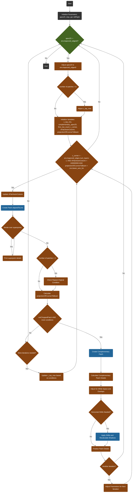

#```mermaid
graph TD;
    classDef default fill:#f9f,stroke:#333,stroke-width:2px;
    classDef functionCall fill:#ff9,stroke:#333,stroke-width:2px;
    
    %% Initialization 
    A(Start) --> B(Initialize Parameters: apexZ0, stop, ppl, leftRight);
    B --> C[Adjust apexZ0 to env.trapezoid_edges0];
    C --> D{While apexZ0 > -env.trapezoid_edges0?};
    D -->|Yes| E(Initialize Variables: z_top_min, complementary_apexZ0, first_row_count, c_corner);
    E --> F[Calculate z_top_max];
    F --> G{Number of patches > 0?};
    G -->|Yes| H(Adjust z_top_max);
    G -->|No| I;
    H --> I(Inner While Loop: Check conditions);
    I --> J(c_corner > -env.trapezoid_edges.num_layers-1.? AND nPatchesInColumn < Limit AND projectionOfCcornerToBeam < env.beam_axis_lim);
    J -->|Yes| K(nPatchesInColumn++);
    K --> L(Create Patch alignedToLine);
    L --> M{Iterate over superpoints};
    M -->|For each superpoint| N(Print superpoint details);
    N --> O{More superpoints?};
    O -->|Yes| M;
    O -->|No| P(Assess Patch Conditions);
    P --> Q{len-patches > 2?};
    Q -->|Yes| R(Check Repeat Original Condition);
    Q -->|No| S(Set seed_apexZ0);
    R --> S;
    S --> T(Calculate projectionOfCcornerToBeam);
    T --> U(Evaluate Square Patch Alternates);
    U --> V{notChoppedPatch AND Conditions?};
    V -->|No| X(Complementary Patch Conditions);
    X -->|Yes| Y{Create Complementary Patch};

    %% complementary patch creation
    Y --> Z(Calculate Complementary Patch Details);
    Z --> A1{Adjust for White Space and Overlaps};
    A1 --> A2{Check Horizontal Shifts Needed};
    A2 -->|Shifts Needed| A3(Apply Horizontal Shifts and Recalculate Shadows);
    A2 -->|No Shifts| A4(Finalize Patch Details);
    A3 --> A4;
    A4 --> A5{Another Iteration?};
    A5 -->|Yes| D;
    A5 -->|No| A6(End);

    class L,Y,A3 functionCall;

```
